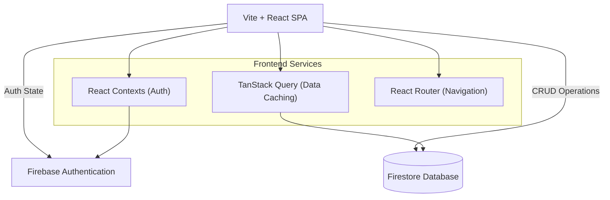
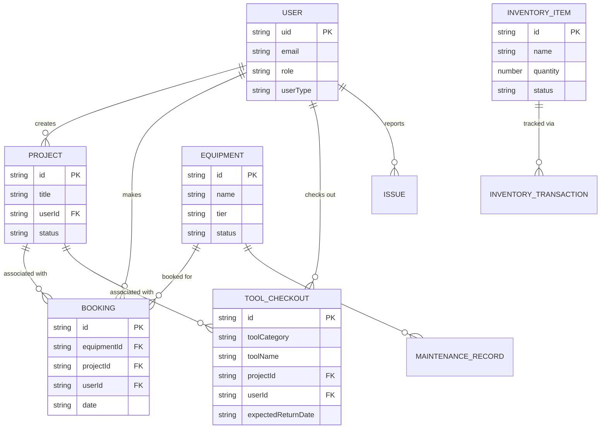

# Architecture

## System Overview

## Components

### Frontend (React/Vite)
- **Responsibility**: Provides the user interface, manages client-side routing, and handles state.
- **Location**: `src/`
- **Key dependencies**: `react`, `react-router-dom`, `@tanstack/react-query`, `lucide-react`, `tailwindcss`.

### Firebase Services
- **Responsibility**: Handles backend infrastructure including user authentication and NoSQL data storage.
- **Location**: Configured in `src/lib/firebase.ts` and managed via `src/services/firebase/`.
- **Key dependencies**: `firebase`.

## Data Model

The following Entity-Relationship diagram outlines the core Firestore collections and their relationships based on the TypeScript definitions:

## Design Decisions

- **Service Layer Pattern**: Firestore interactions are decoupled into a dedicated service layer (`src/services/firebase/`) using native Firebase SDK methods to streamline data access across the application.
- **Data Caching**: `@tanstack/react-query` is heavily utilized to cache Firestore document reads, reducing database reads and improving UI responsiveness.
- **Tailwind & shadcn/ui**: The UI is built with a utility-first CSS framework (Tailwind) and reusable components (inspired by shadcn/ui) for rapid, consistent development.

## Technology Stack

| Layer | Technology | Notes |
|---|---|---|
| Frontend | React 19 (Vite) | Main SPA framework |
| Styling | Tailwind CSS | Utility-first styling |
| Backend | Firebase | Auth and Firestore |
| State/Cache | TanStack Query | Remote data fetching and caching |
| Routing | React Router | Client-side routing |
