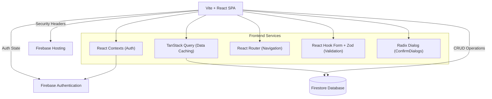
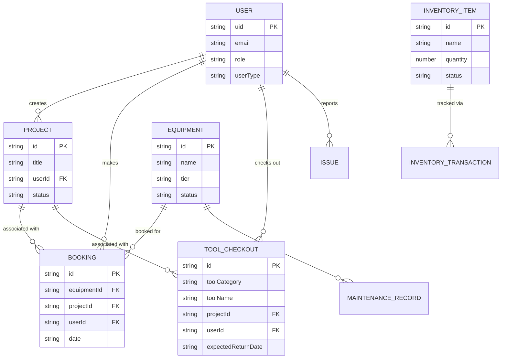

# Architecture

## System Overview

```mermaid
flowchart TD
    Client["Vite + React SPA"] -->|Auth State| FirebaseAuth["Firebase Authentication"]
    Client -->|CRUD Operations| FirestoreDB[("Firestore Database")]
    Client -->|Security Headers| FirebaseHosting["Firebase Hosting"]
    
    subgraph "Frontend Services"
        Contexts["React Contexts (Auth)"]
        Query["TanStack Query (Data Caching)"]
        Router["React Router (Navigation)"]
        Forms["React Hook Form + Zod (Validation)"]
        Modals["Radix Dialog (ConfirmDialogs)"]
    end
    
    Client --> Contexts
    Client --> Query
    Client --> Router
    Client --> Forms
    Client --> Modals
    
    Query --> FirestoreDB
    Contexts --> FirebaseAuth
```

## Components

### Frontend (React/Vite)
- **Responsibility**: Provides the user interface, manages client-side routing, and handles state.
- **Location**: `src/`
- **Key dependencies**: `react`, `react-router-dom`, `@tanstack/react-query`, `react-hook-form`, `zod`, `@hookform/resolvers`, `@radix-ui/react-dialog`, `lucide-react`, `tailwindcss`.

### Form Validation (`src/lib/form.ts`)
- **Responsibility**: Provides a typed wrapper (`typedZodResolver`) around `@hookform/resolvers/zod` for type-safe form validation with Zod v4 schemas.
- **Usage**: All form pages (`EquipmentFormPage`, `BookingFormPage`, `ProjectFormPage`, etc.) use this wrapper instead of raw `zodResolver` + `as any` casts.

### Shared UI Components
- **`ConfirmDialog`** (`src/components/common/ConfirmDialog.tsx`): Reusable Radix UI dialog for destructive or default confirmation prompts. Replaces `window.confirm()` calls across the app with a consistent, accessible modal.

### Firebase Services
- **Responsibility**: Handles backend infrastructure including user authentication and NoSQL data storage.
- **Location**: Configured in `src/lib/firebase.ts` and managed via `src/services/firebase/`.
- **Key dependencies**: `firebase`.

## Data Model

The following Entity-Relationship diagram outlines the core Firestore collections and their relationships based on the TypeScript definitions:

```mermaid
erDiagram
    USER ||--o{ PROJECT : "creates"
    USER ||--o{ BOOKING : "makes"
    USER ||--o{ TOOL_CHECKOUT : "checks out"
    USER ||--o{ ISSUE : "reports"
    
    PROJECT ||--o{ BOOKING : "associated with"
    PROJECT ||--o{ TOOL_CHECKOUT : "associated with"
    
    EQUIPMENT ||--o{ BOOKING : "booked for"
    EQUIPMENT ||--o{ MAINTENANCE_RECORD : "undergoes"
    
    INVENTORY_ITEM ||--o{ INVENTORY_TRANSACTION : "tracked via"

    USER {
        string uid PK
        string email
        string role
        string userType
    }
    
    PROJECT {
        string id PK
        string title
        string userId FK
        string status
    }
    
    EQUIPMENT {
        string id PK
        string name
        string tier
        string status
    }
    
    BOOKING {
        string id PK
        string equipmentId FK
        string projectId FK
        string userId FK
        string date
    }
    
    TOOL_CHECKOUT {
        string id PK
        string toolCategory
        string toolName
        string projectId FK
        string userId FK
        string expectedReturnDate
    }
    
    INVENTORY_ITEM {
        string id PK
        string name
        number quantity
        string status
    }
```

## Design Decisions

- **Service Layer Pattern**: Firestore interactions are decoupled into a dedicated service layer (`src/services/firebase/`) using native Firebase SDK methods to streamline data access across the application.
- **Data Caching**: `@tanstack/react-query` is heavily utilized to cache Firestore document reads, reducing database reads and improving UI responsiveness.
- **Tailwind & Radix UI**: The UI is built with a utility-first CSS framework (Tailwind) and accessible primitives (Radix UI) for dialogs, combined with custom components modeled on shadcn/ui patterns.
- **Form Handling**: React Hook Form + Zod provide typed, validated form handling. A centralized `typedZodResolver` wrapper in `src/lib/form.ts` normalizes Zod v4 compatibility across all form pages.
- **Security Headers**: HTTP security headers (CSP, HSTS, X-Frame-Options, X-Content-Type-Options, Referrer-Policy) are enforced at the Firebase Hosting level via `firebase.json`.
- **Server-Side Rate Limiting**: Feedback submissions are rate-limited server-side via Firestore security rules enforcing deterministic document IDs keyed by `userId + time window` (server clock), in addition to a client-side localStorage cooldown.

## Security Model

Authorization is enforced **server-side** by `firestore.rules` and `storage.rules`; the client only mirrors those decisions for UX. See [docs/roles_and_permissions.md](docs/roles_and_permissions.md) and [docs/auth-architecture.md](docs/auth-architecture.md) for details.

### Roles

- `isAdmin()` = `super_admin`; `isStaff()` = `super_admin | faculty | lab_assistant`.
- Both helpers require an **active** account (`users/{uid}.isActive != false`). When an admin deactivates a user, that account immediately loses self-service and elevated access server-side (see "Known client-side-only enforcement" below for the residual catalog reads).
- Every elevated-role write (`equipment`, `inventory`, `inventoryTransactions`, `maintenance`, `workshops`, `announcements`, `auditLogs`, `settings`) is staff/admin-only.

### Enforcement highlights

- **Users**: self-create with `role = 'student'` only; owners update their own non-sensitive fields; `role`/`isActive`/`email` changes require `super_admin`. Client-side, profile writes strip `uid`/`email`/`role`/`isActive` from any caller-supplied data.
- **Projects**: readable only by the owner and staff (no cross-user PII leak). Users create `pending` projects and may edit their own non-`status` fields; status changes are admin-only.
- **Bookings**: active users only; must reference a **confirmed Tier-1 bookable** machine that is `available`/`reserved`, with a valid `HH:MM` window and a strict field allowlist.
- **Tool checkouts**: strict schema — `action = 'checking_out'`, valid enums, `isOverdue = false`; owners may only perform a return (or flip the overdue flag), never rewrite the tool/project details.
- **Issues**: new issues start `open` with valid `type`/`severity`; resolution/status fields are staff-only.
- **Audit logs**: staff-only writes (immutable); read by admins.
- **Feedback**: deterministic `userId_windowId` document IDs enforce 1-per-5-minute submissions (server clock).
- **Storage**: equipment images are readable by any authenticated user but writable/deletable by staff only.

### Known client-side-only enforcement (require Cloud Functions)

These business rules are enforced only in the UI because security rules cannot run queries/transactions, and this repo has no backend/Cloud Functions layer yet:

- Booking time-slot **overlap detection** and the "booking must reference an active project" requirement (`checkBookingConflict`, `userHasActiveProject`).
- Tool checkout `isOverdue` computation (a daily server sweep is planned as "Phase 9").
- The 200-word feedback limit (the server enforces a 2000-character cap instead).
- Server-populated display identity (`userName`/`userEmail`) — currently client-supplied; only `userId` is rule-enforced.
- Sequential project IDs (`generateProjectId` uses `getCountFromServer() + 1`, which can race under concurrency).

## Utilities (`src/lib/utils.ts`)

- **`cn`**: Tailwind class merging via `clsx` + `tailwind-merge`.
- **`formatDate` / `formatDateTime` / `formatRelativeTime`**: Date formatting utilities with proper `FirestoreDateValue` type support (Timestamp, Date, seconds-object, string, number).
- **`cleanFirestoreData`**: Strips `undefined` values from objects before writing to Firestore.
- **`mapDocs<T>`**: Generic helper to map Firestore `QueryDocumentSnapshot[]` to typed arrays with `id` injection.
- **`debugLog`**: Dev-gated logging (`console.error` only in `import.meta.env.DEV`) to replace production console.error calls.

## Technology Stack

| Layer | Technology | Notes |
|---|---|---|
| Frontend | React 19 (Vite) | Main SPA framework |
| Styling | Tailwind CSS | Utility-first styling |
| Backend | Firebase | Auth and Firestore |
| State/Cache | TanStack Query | Remote data fetching and caching |
| Routing | React Router | Client-side routing |
| Form(s) | React Hook Form + Zod | Typed, validated forms |
| Dialogs | Radix UI | Accessible modal primitives |
| Linting | oxlint | Fast Rust-based linter |
