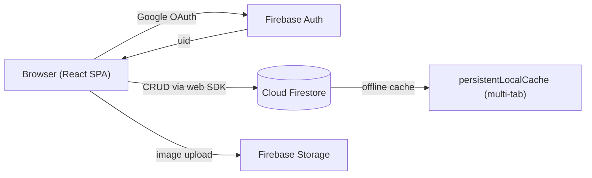
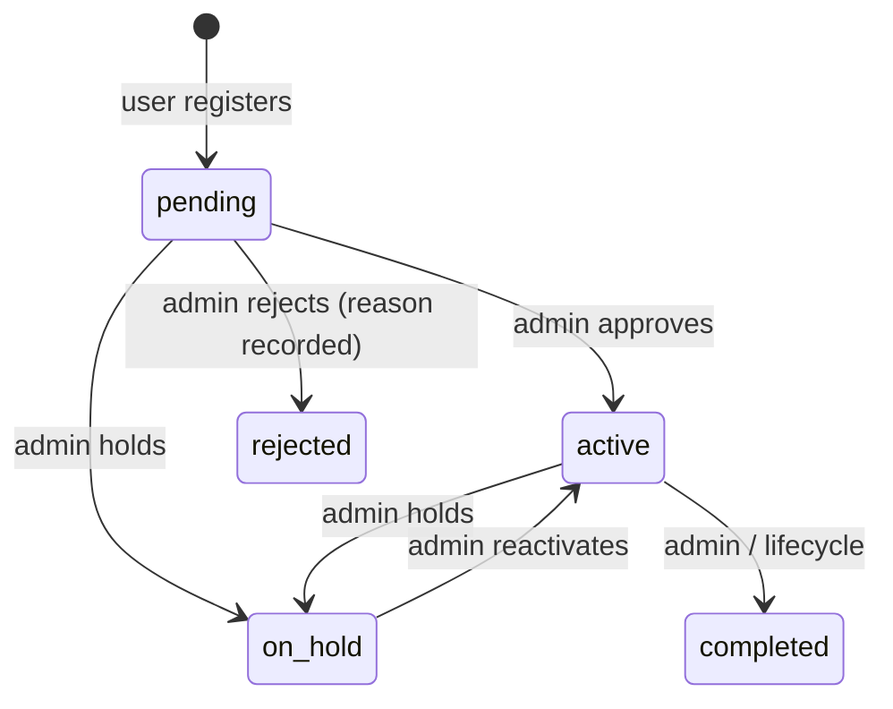

# Tinkers Lab Platform — Data Architecture & Firebase Storage Guide

> **What this document covers:** every Firestore collection, every field, how document IDs are generated, how data flows from the UI into Firebase (with the full **project registration** walkthrough), the security rules, Storage layout, and indexes.
>
> **Companion docs:** [`overview.md`](overview.md) (system overview) · [`../README.md`](../README.md) (docs index) · [`../../src/types/index.ts`](../../src/types/index.ts) (single source of truth for all TypeScript types)
>
> **⚠️ June restructure:** bookings, tool checkouts, and a new activity log now live as **subcollections under each project** (`projects/{projectId}/bookings/…`, `projects/{projectId}/checkouts/…`, `projects/{projectId}/activityLog/…`). Cross-project views use **collection-group queries**. Project codes (`TL-XXX`) are generated from an **atomic counter** document (`counters/projects`). Migration script: `scripts/migrateToSubcollections.ts`.

---

## 1. High-Level Storage Overview

The app uses **three Firebase services**:

| Service | Purpose | Used for |
|---|---|---|
| **Firebase Auth** | Identity | Google sign-in (popup + redirect fallback). Produces the `uid` that keys everything else. |
| **Cloud Firestore** | Primary database | 15 top-level collections + 3 project subcollections (bookings, checkouts, activityLog) + 1 counter doc |
| **Firebase Storage** | Binary files | Equipment images only (`equipment/{equipmentId}/...`), max 5 MB, jpeg/png/webp |



**Client-side setup** (`src/lib/firebase.ts`):

- Firestore is initialized with `persistentLocalCache({ tabManager: persistentMultipleTabManager() })` → the app works offline and caches reads (keeps free-tier read usage low).
- Dev mode supports **emulators** when `VITE_USE_EMULATORS=true` (Auth `:9099`, Firestore `:8080`, Storage `:9199`).
- Config comes from `VITE_FIREBASE_*` env vars; the API key may be passed Base64-encoded as `VITE_FIREBASE_API_KEY_B64` and is decoded at runtime.
- Reads use the web SDK; trusted creates and transactional business rules use the deployed **Cloud Functions** layer. Firestore security rules remain the defense-in-depth boundary (section 6).

---

## 2. The Firestore Collections

Collection names are defined once in [`src/services/firebase/firestore.ts`](../../src/services/firebase/firestore.ts) (`COLLECTIONS` constant — the single source of truth).

| # | Collection | Document ID | Who creates | Notes |
|---|---|---|---|---|
| 1 | `users` | **Firebase Auth `uid`** | Self on first sign-in | The join key for the whole app |
| 2 | `projects` | **Auto-generated random** + business `projectCode` field `TL-001` | **Cloud Function** (`createProject`) | **Anchor document** — bookings/checkouts/activityLog hang under it |
| 3 | `projects/{id}/bookings` | Auto-generated | **Cloud Function** (`createBooking`) | **Subcollection** — Tier-1 machine time slots, auto-approved |
| 4 | `projects/{id}/checkouts` | Auto-generated | **Cloud Function** (`createToolCheckout`) | **Subcollection** — Tier-2 tool borrow/return log |
| 5 | `projects/{id}/activityLog` | Auto-generated | Owner/staff appends + Cloud Functions | **Subcollection** — immutable unified project timeline |
| 6 | `counters` | Fixed doc `projects` | System (transaction) | Atomic `{ nextId: N }` — powers `TL-XXX` codes |
| 7 | `equipment` | Auto-generated | Staff (seeded) | 49 machines/tools in `scripts/seedEquipment.ts` |
| 8 | `inventory` | Auto-generated | Staff | Stock management |
| 9 | `inventoryTransactions` | Auto-generated | Staff | Restock/adjustment/damage ledger |
| 10 | `maintenance` | Auto-generated | Staff | Maintenance records |
| 11 | `workshops` | Auto-generated | Staff | Workshops/training sessions |
| 12 | `workshopRegistrations` | Auto-generated | User | Sign-ups for workshops |
| 13 | `notifications` | Auto-generated | Staff | In-app notifications (per-user) |
| 14 | `announcements` | Auto-generated | Staff | Broadcast announcements |
| 15 | `issues` | Auto-generated | User | Issue/suggestion reports (Form 4) |
| 16 | `auditLogs` | Auto-generated | Staff | **Immutable** admin audit trail |
| 17 | `settings` | Auto-generated | Admin | App settings |
| 18 | `feedback` | **`{uid}_{5-min-window}`** | User | Rate-limited (max 1 per user per 5 min) |

### Denormalization rule (important)

There are **no cross-collection joins** in Firestore (NoSQL). Whenever a child document needs to display info about its parent (user name/email, project title, machine name), that data is **copied onto the child document** at write time:

- `bookings` (now `projects/{id}/bookings`) store `userId`, `userEmail`, `userName`, `projectId`, `projectTitle`, `machineId`, `machineName`
- `checkouts` (now `projects/{id}/checkouts`) store `userId`, `userEmail`, `userName`, `universityId`, `projectId`, `projectTitle`
- `issues` store `userId`, `userName`, `userEmail`
- `maintenance` stores `equipmentId`, `machineId`, `machineName`
- `inventoryTransactions` store `itemId`, `itemName`, `userId`, `userName`, `userEmail`

This means queries never need a second fetch to render lists — at the cost of data duplication (acceptable for a lab app; a mismatch would only happen if a display name changes, which is why renames propagate only on future writes).

---

## 3. Collection Schemas (exact fields)

Types below mirror [`src/types/index.ts`](../../src/types/index.ts). `Timestamp` = Firestore server timestamp. Strings marked `"YYYY-MM-DD"` / `"HH:MM"` are **strings**, not dates (kept as strings for cheap range comparisons and indexable queries).

### 3.1 `users/{uid}`

> Document ID **= the Firebase Auth UID** — this is what links a Google account to every other collection.

| Field | Type | Notes |
|---|---|---|
| `uid` | string | = document ID |
| `email` | string | From Google account |
| `displayName` | string | |
| `role` | enum | `student` (default) · `faculty` · `lab_assistant` · `super_admin` |
| `userType` | enum | `Student` · `Professor or Faculty` · `Venture Studio Startup` · `External Visitor` |
| `isActive` | boolean | `false` **revokes all access** (checked in rules) |
| `createdAt` / `updatedAt` | Timestamp | |
| `contact`?, `department`? | string | Common |
| `universityId`?, `courseName`?, `facultyAdvisor`?, `teamName`?, `teamMembers`? | string | Student-specific (Form 1 §2) |
| `researchArea`?, `associatedCourse`?, `studentsInvolved`? | string | Faculty-specific (Form 1 §3) |
| `startupName`?, `industryDomain`?, `startupBrief`?, `labTeamMembers`? | string | Venture-Studio-specific (Form 1 §4) |
| `organization`?, `designation`?, `purposeOfVisit`?, `referral`? | string | External-Visitor-specific (Form 1 §5) |
| `safetyAgreementAccepted`?, `termsAccepted`? | boolean | Acknowledgements (Form 1 §7) |

**Key rules about this collection:**
- A new user can only self-create with `role: 'student'` — the rules reject any other role on create.
- Users can update their **own** profile but **cannot change** `role`, `isActive`, or `email` (blocked both in `auth.ts` and in Firestore rules).
- Only `super_admin` can change roles / deactivate accounts.

### 3.2 `projects/{docId}` — the Project Registration collection

> **Two IDs on every project:**
> - **Document ID** — auto-generated by Firestore (used in URLs and `doc()` refs; exposed to UI as `docId`)
> - **`projectCode` field** — sequential business code `TL-001`, `TL-002`, … (what users/admins see)

| Field | Type | Notes |
|---|---|---|
| `id` | — (removed) | Renamed to `projectCode` — fixes the old silent overwrite bug |
| `projectCode` | string | Sequential `TL-XXX` — generated atomically from `counters/projects` |
| `title` | string | Min 5 chars (Zod) |
| `abstract` | string | Min 50 chars (Zod) |
| `userId` | string | Owner's Auth UID |
| `userName` | string | Denormalized from profile |
| `userEmail` | string | Denormalized |
| `userType` | enum | Copied from profile at registration |
| `contact` | string | Phone or email |
| `department`?, `universityId`? | string | |
| `teamMembers`?, `facultyMentor`? | string | Defaults to `''` |
| `startDate` | string `"YYYY-MM-DD"` | |
| `endDate`? | string `"YYYY-MM-DD"` | Optional |
| `expectedEquipmentNeeds` | array of enum | Checkbox list (16 options incl. `Other`) |
| `equipmentNeedsOther`? | string | Shown only when `Other` checked |
| `resourceLink`? | string | http(s) URL, optional |
| `safetyAgreementAccepted` | boolean | **Must be `true`** (rules enforce) |
| `termsAccepted` | boolean | **Must be `true`** (rules enforce) |
| `status` | enum | `pending` (default) → `active` / `rejected` / `on_hold` / `completed` |
| `rejectionReason`? | string | Set by admin on reject |
| `imageUrls` / `documentUrls` | string[] | Empty on create; uploaded from the project edit view |
| `createdAt` / `updatedAt` | Timestamp | |

**Status lifecycle:**



**Visibility:** a project is readable only by **its owner or staff** (not other students).

### 3.3 `projects/{projectId}/bookings/{docId}` — Tier-1 machine time slots (Form 2A)

> **Location change:** bookings are a **subcollection under their project**. All cross-project queries (admin list, conflict checks, user history) use **collection-group queries** on the `bookings` collection id — same field shapes as before, no extra reads.

| Field | Type | Notes |
|---|---|---|
| `equipmentId` | string | FK → `equipment` doc ID (used in conflict queries) |
| `machineId` | string | Slug e.g. `laser-cutter` (from equipment) |
| `machineName` | string | Denormalized |
| `userId` / `userEmail` / `userName` | string | Denormalized user |
| `projectId` / `projectTitle` | string | **Required** — must reference a registered project |
| `date` | string `"YYYY-MM-DD"` | |
| `startTime` / `endTime` | string `"HH:MM"` | Rules enforce `start < end` |
| `purpose` | string | |
| `consumables`? | object | `filamentType/filamentColor/filamentQuantityGrams` (3D printers) or `materialType/materialSize` (laser cutter) |
| `safetyAgreementAccepted` | boolean | Must be `true` |
| `status` | enum | `approved` (default) · `rejected` · `cancelled` · `completed` |
| `rejectionReason`? | string | On reject |
| `cancelledBy`? | string | On cancel |
| `createdAt` / `updatedAt` | Timestamp | |

**Auto-confirm model (Spec 2):** bookings are written as `approved` immediately. `createBooking` performs the conflict check transactionally and verifies the equipment is a `confirmed` + `bookable` (Tier-1) machine with status `available`/`reserved`.

### 3.4 `projects/{projectId}/checkouts/{docId}` — Tier-2 tool borrow/return (Form 2B)

> **Location change:** tool checkouts are a **subcollection under their project** (`checkouts`). Collection-group queries on `checkouts` power all cross-project views. `returnTool()` / `markCheckoutOverdue()` now require `projectId` to build the subcollection path.

| Field | Type | Notes |
|---|---|---|
| `userId` / `userEmail` / `userName` / `universityId`? | string | Denormalized user |
| `projectId` / `projectTitle` | string | **Required** |
| `action` | enum | `checking_out` → `returning` on return |
| `toolCategory` | enum | `Power Tools` · `Hand Tools` · `Measurement Tools` · `Safety Equipment` · `Other` |
| `toolName` | string | Free text (matched against inventory on the viewer side) |
| `quantity` | number | |
| `locationOfUse` | enum | `in_lab` · `taking_outside` |
| `outsideLocation`? | string | **Required by rules** if `taking_outside` |
| `expectedReturnDate` | string `"YYYY-MM-DD"` | |
| `expectedReturnTime`? | string `"HH:MM"` | |
| `conditionAtCheckout` | enum | `good` · `fair` · `damaged` |
| `conditionAtReturn`? | enum | Set on return |
| `returnedAt`? | Timestamp | Set on return |
| `isOverdue` | boolean | Computed client-side: `expectedReturnDate < today && returnedAt == null` |
| `notes`? | string | |
| `createdAt` / `updatedAt` | Timestamp | |

### 3.5 `equipment/{docId}` — the equipment catalog

| Field | Type | Notes |
|---|---|---|
| `machineId` | string | Slug e.g. `bambu-x1c` |
| `name` | string | |
| `tier` | enum | `bookable` (Tier 1) · `checkout` (Tier 2) · `freely_available` (Tier 3) |
| `confirmed` | boolean | **`true` = physically in the lab.** Only `true` Tier-1 machines can be booked |
| `category` | enum | `Digital Fabrication` · `Heavy Duty` · `Tabletop Power` · `Electronics` · `Other` |
| `description` | string | |
| `manufacturer`?, `modelNumber`?, `serialNumber`? | string | |
| `purchaseDate`?, `warrantyInfo`?, `installationDate`? | string | |
| `status` | enum | `available` · `reserved` · `in_use` · `under_maintenance` · `out_of_service` · `retired` |
| `healthStatus` | enum | `good` · `fair` · `poor` |
| `location` | string | Physical zone |
| `requiresTraining` | boolean | |
| `imageUrls` / `manualUrls` / `safetyDocUrls` | string[] | Storage download URLs |
| `createdAt` / `updatedAt` | Timestamp | |

Seeded by `scripts/seedEquipment.ts` (49 entries): 14 Tier-1 machines (4 confirmed: Bambu X1C, Ender 3 V3+, Phrozen 12K, Laser Cutter), 32 Tier-2 tools, 6 Tier-3 safety items + infrastructure.

### 3.6 `inventory/{docId}` & `inventoryTransactions/{docId}`

**inventory**: `name`, `category` (11 enums), `description?`, `quantity`, `minQuantity` (alert threshold), `unit`, `location`, `barcode?`, `supplierName?`, `supplierContact?`, `unitCost?`, `status` (`in_stock|low_stock|out_of_stock`), timestamps.

**inventoryTransactions**: `itemId`, `itemName`, `type` (`restock|adjustment|damage|write_off`), `quantity` (+/−), `quantityBefore`, `quantityAfter`, `userId`, `userName`, `userEmail`, `notes?`, `createdAt`. → Admin-only ledger; **tool checkouts do NOT decrement inventory** in v1 (Spec 2 decision).

### 3.7 `maintenance/{docId}`

`equipmentId`, `machineId`, `machineName`, `type` (`preventive|corrective|calibration|repair|inspection`), `status` (`scheduled|in_progress|completed|cancelled`), `title`, `description`, `scheduledDate`, `completedDate?`, `technician`, `technicianContact?`, `parts?`, `laborCost?`, `partsCost?`, `downtimeHours?`, `notes?`, `reportUrls[]`, timestamps.

### 3.8 `workshops/{docId}` & `workshopRegistrations/{docId}`

**workshops**: `title`, `type` (`training|workshop|certification|safety_training`), `description`, `instructor`, `instructorEmail?`, `date`, `startTime`, `endTime`, `capacity`, `registeredCount`, `prerequisites?`, `materials?`, `location`, `isActive`, `certificateIssued`, `materialUrls[]`, timestamps.

**workshopRegistrations**: `workshopId`, `workshopTitle`, `userId`, `userName`, `userEmail`, `status` (`registered|attended|cancelled|no_show`), `feedback?`, `rating?` (1–5), `certificateIssued`, timestamps.

### 3.9 `notifications/{docId}` & `announcements/{docId}`

**notifications**: `userId`, `type` (14 enum values incl. `booking_approved`, `booking_rejected`, `checkout_overdue`, `project_approved`, `project_rejected`, …), `title`, `message`, `link?`, `isRead`, `createdAt`.

**announcements**: `title`, `body`, `priority` (`normal|high|urgent`), `isActive`, `authorId`, `authorName`, `expiresAt?`, timestamps.

> Note: today **only staff create notifications** — the "booking approved/rejected email" flows are deferred (Phase 9).

### 3.10 `issues/{docId}` (Form 4)

`userId`, `userName`, `userEmail`, `type` (`machine_malfunction|safety_concern|missing_damaged|suggestion|other`), `severity` (`low|medium|high|urgent`), `status` (`open|in_progress|resolved|closed`), `relatedMachine?`, `description` (≥ 20 chars enforced), `dateNoticed?`, `resolution?`, `resolvedBy?`, `resolvedAt?`, timestamps. Users **cannot edit** after submission; staff handle status/resolution.

### 3.11 `auditLogs/{docId}`

`userId`, `userEmail`, `action`, `resource`, `resourceId`, `details?`, `createdAt`. **Append-only & immutable** — staff can create, nobody can update/delete (rules: `allow update, delete: if false`).

### 3.12 `settings/{docId}` & `feedback/{docId}`

**settings**: read by staff, written only by admin.

**feedback**: `userId`, `message` (≤ 2000 chars), `createdAt` — plus **rate limiting built into the document ID**: `feedbackId == uid + "_" + floor(nowMillis / 300000)` so a second write within the same 5-minute window targets an existing doc and is rejected. Nobody can edit/delete feedback.

### 3.13 `projects/{projectId}/activityLog/{docId}` — project timeline (new)

| Field | Type | Notes |
|---|---|---|
| `type` | enum | `booking` · `checkout` · `return` · `status_change` |
| `summary` | string | Human-readable, ≤ 300 chars (rules) |
| `resourceId`? | string | booking/checkout doc ID if applicable |
| `userId` / `userName` / `userEmail` | string | Actor who triggered the entry |
| `createdAt` | Timestamp | |

Written automatically when bookings/checkouts are created or returned, and when a project or booking status changes. **Immutable** (rules: `allow update, delete: if false`). Rendered on the project detail page as a timeline.

---

## 4. How Document IDs Are Generated

| Collection | ID strategy | Mechanism |
|---|---|---|
| `users` | Deterministic | `users/{authUid}` via `setDoc` |
| `feedback` | **Auto (function)** | `submitFeedback` callable — server ID + `feedbackWindows/{uid}` cooldown |
| `projects` | **Hybrid** | Firestore random **doc ID** + sequential `projectCode` field (`TL-XXX`) via atomic counter |
| `projects/{id}/bookings` · `checkouts` · `activityLog` · `projectMembers` | Random | `addDoc` → Firestore auto-ID |
| everything else | Random | `addDoc` → Firestore auto-ID |

### `projectCode` generation — atomic counter (`src/services/firebase/projects.ts`)

```ts
const counterRef = doc(db, 'counters', 'projects')
await runTransaction(db, async (tx) => {
  const snap = await tx.get(counterRef)
  const nextId = snap.exists() ? snap.data().nextId : 1
  tx.set(counterRef, { nextId: nextId + 1 }, { merge: true })   // atomic increment
  tx.set(projectDocRef, { ...payload, projectCode: `TL-${pad3(nextId)}` })
})
```

- Uses a **transaction on `counters/projects`** → race-free `TL-XXX` generation (fixes the old `getCountFromServer()` race).
- The counter increment and the project document write happen **atomically together**.
- ⚠️ **Since the Cloud Functions layer landed, this transaction runs server-side** in the `createProject` callable (`functions/src/createProject.ts`) — direct client writes to `counters` and `projects` are denied by rules so a client cannot tamper with the counter.

---

## 5. Walkthrough — "I register a new project" (end to end)

This is the exact path a user's project takes from form to Firestore:

### Step 1 — Sign in (creates the user doc)
1. User clicks **Sign in with Google** → `signInWithPopup(auth, googleProvider)` (`src/services/firebase/auth.ts`). If popup blocked → falls back to `signInWithRedirect`.
2. `AuthContext` (`src/contexts/AuthContext.tsx`) listens via `onAuthStateChanged` and subscribes to `users/{uid}` with `onSnapshot` (live listener).
3. `ensureUserProfile(user)` checks `users/{uid}`; if missing, `createUserProfile` writes it with `setDoc(..., { merge: true })`:
   ```ts
   {
     uid, email, displayName,
     role: 'student',        // hard-coded — rules only allow 'student' on self-create
     userType: 'Student',
     isActive: true,
     department: '',
     createdAt: serverTimestamp(), updatedAt: serverTimestamp(),
     ...safeExtraData      // privilege fields (role/isActive/email/uid) are STRIPPED
   }
   ```

### Step 2 — Fill the registration form
1. User opens `/projects/new` → `ProjectFormPage` (`src/features/projects/ProjectFormPage.tsx`).
2. `react-hook-form` + **Zod schema** validates: title ≥ 5 chars, abstract ≥ 50 chars, contact required, startDate required, valid http(s) `resourceLink` if provided, **both agreements must be checked**.
3. Form **pre-fills** `userId`, `userEmail`, `userName`, `userType`, `department`, `teamMembers`, `facultyMentor` from the signed-in profile — the user never types these.

### Step 3 — Submit → `createProject()`
`src/services/firebase/projects.ts` runs:
1. Opens a **transaction** on `counters/projects` → reads `nextId`, increments it, and writes the project doc with `projectCode: TL-001` — all atomically.
2. Builds the payload:
   ```ts
   {
     ...formData,
     projectCode: 'TL-001',     // business ID (from atomic counter)
     status: 'pending',         // MUST be 'pending' (rules enforce)
     imageUrls: [], documentUrls: [],
     createdAt: serverTimestamp(), updatedAt: serverTimestamp(),
   }
   ```
3. `cleanFirestoreData(payload)` strips `undefined` values and keeps Firestore sentinels (`FieldValue`/`Timestamp`) intact.
4. The transaction `set()`s the doc at a **pre-generated random doc ID** (e.g. `aB3xY9zW...`).
5. Returns that doc ID; the app navigates to `/projects/{docId}` and shows *"Project registered! Pending review by a coordinator."*

### Step 4 — Rules gate the write
Before the doc is committed, `firestore.rules` checks (all must pass):
- writer is authenticated and **active** (`isActiveUser()`)
- `userId == request.auth.uid` (no impersonation)
- `status == 'pending'`
- `safetyAgreementAccepted == true && termsAccepted == true`

### Step 5 — Admin approves/rejects
1. Admin views all projects (`AdminProjectsPage`, status filter; query uses the `projects` index on `status + createdAt`).
2. `updateProjectStatus(firestoreDocId, 'active' | 'rejected' | 'on_hold' | 'completed', rejectionReason?)` runs `updateDoc` on **status** (+ optional `rejectionReason`), then **appends a `status_change` entry to the project's `activityLog`**.
3. Rules allow the status change because the writer is `super_admin`.
4. From now on the project shows as `active` in the user's project selector, which is the gate for Forms 2A/2B: **every booking and tool checkout requires a `projectId`** (enforced in `BookingFormPage`/`ToolCheckoutPage` via `userHasActiveProject()`).

### How it's stored (final state)

```
users/{authUid}                    ← created in Step 1
  role: "student", userType: "Student", isActive: true, ...

counters/projects                  ← initialized by first registration (Step 3)
  nextId: 2

projects/{aB3xY9zW}                ← created in Step 3 (random doc ID)
  projectCode: "TL-001",           ← atomic-counter business ID
  title: "...", abstract: "...", contact: "...",
  userId: "<authUid>", userEmail: "...", userName: "...", userType: "...",
  startDate: "2026-08-14", endDate: "",
  expectedEquipmentNeeds: ["3D Printer", "Other"],
  equipmentNeedsOther: "CNC router",
  safetyAgreementAccepted: true, termsAccepted: true,
  status: "pending",               ← becomes "active" in Step 5
  imageUrls: [], documentUrls: [],
  createdAt: <server ts>, updatedAt: <server ts>

projects/{aB3xY9zW}/bookings/…     ← booking subcollection (Form 2A)
projects/{aB3xY9zW}/checkouts/…    ← checkout subcollection (Form 2B)
projects/{aB3xY9zW}/activityLog/…  ← unified timeline (immutable)
```

### Booking against that project (same pattern)
1. `BookingFormPage` → user picks a **confirmed Tier-1 machine**, date, time, and **selects their active project** (dropdown shows `projectCode` — `TL-XXX`).
2. `createBooking` runs the **collection-group query** on `bookings` (`equipmentId + date + status`) inside a transaction, then performs the interval-overlap test. On conflict → throws → user sees error.
3. Payload written to **`projects/{projectId}/bookings/{autoId}`** with `status: 'approved'`, denormalized `projectId` + `projectTitle` + user fields, server timestamps. A **`booking` activity-log entry** is appended.
4. Rules re-verify the parent project is owned by the user + equipment tier/confirmed/status + schema allowlists.
5. Tool checkout follows the same pattern into **`projects/{projectId}/checkouts/{autoId}`** (+ `checkout` / `return` activity entries).

---

## 6. Firestore Security Rules — Access Matrix

Defined in [`firestore.rules`](../../firestore.rules) (rules_version 2). Helper functions:

| Helper | Definition |
|---|---|
| `isAuth()` | `request.auth != null` |
| `isOwner(uid)` | auth uid == doc uid |
| `isActiveUser()` | authenticated **and** `users/me.isActive != false` — **this is what deactivation enforces** |
| `isAdmin()` | active + `role == 'super_admin'` |
| `isStaff()` | active + role ∈ `[super_admin, faculty, lab_assistant]` |

| Collection | read | create | update | delete |
|---|---|---|---|---|
| `users` | owner or admin | self, `role='student'` only | owner (not role/isActive/email) or admin | admin |
| `projects` | owner or staff | **function only** (`createProject` callable) | owner (not `status`) or admin | admin |
| `projects/{id}/bookings` | project owner or staff | **function only** (`createBooking` callable — transactional conflict check) | owner (cancel only) or staff | admin |
| `projects/{id}/checkouts` | project owner or staff | **function only** (`createToolCheckout`) | owner (validated return/overdue keys) or staff | admin |
| `projects/{id}/activityLog` | project owner or staff | active owner checkout/return or staff status-change entries; server functions write creation/booking entries | **nobody** (immutable) | **nobody** |
| `projects/{id}/projectMembers` | project owner or staff | project owner or staff | project owner or staff | owner or admin |
| `counters` | active user | **function only** (deny direct) | — | — |
| `equipment` | any auth | staff | staff | staff |
| `inventory` | any auth | staff | staff | admin |
| `inventoryTransactions` | any auth | **staff** | admin | admin |
| `maintenance` | any auth | staff | staff | admin |
| `workshops` | any auth | staff | staff | admin |
| `workshopRegistrations` | owner or staff | active user, own | staff or owner | admin |
| `notifications` | own only | **staff** | own `isRead` only | admin |
| `announcements` | any auth | staff | staff | staff |
| `issues` | owner or staff | active user, own, `status='open'`, valid enums, description ≥ 20 chars, **exhaustive key allowlist** | **staff only** | admin |
| `auditLogs` | admin | staff | **nobody** (immutable) | **nobody** |
| `settings` | staff | admin | admin | admin |
| `feedback` | staff | **function only** (`submitFeedback` callable) | nobody | nobody |
| `{document=**}` (default) | **deny** | **deny** | **deny** | **deny** |

**Collection-group note:** the `bookings`, `checkouts`, and `activityLog` subcollection rules also gate collection-group reads (project owner or staff) — that's how the admin "all bookings" view and per-user history stay secure.

**Security patterns used:**
- **Exhaustive key allowlists** (`hasOnly([...])`) on bookings, checkouts, issues, feedback → blocks field injection.
- **Server-side enum checks** on create (status, category, condition, severity…).
- **Schema shape checks** (`is string`, regex `[0-9]{4}-[0-9]{2}-[0-9]{2}`, `startTime < endTime`).
- **Cross-doc validation** with `get()` on `equipment` (tier/confirmed/status) during booking create.
- Each `get()` helper call costs 1 read — comments warn to minimise usage (free tier).

---

## 7. Firebase Storage

**Rules** (`storage.rules`): reads require auth; writes/deletes are staff-only, restricted to `image/(jpeg|png|webp)` and ≤ 5 MB; default deny for everything else.

**Path layout** (`src/services/firebase/equipmentImages.ts`):

```
equipment/{equipmentId}/{timestamp}_{sanitizedFileName}
```

e.g. `equipment/bambu-x1c/1723641234567_side_view.png`

- Filenames are sanitized (`[^a-zA-Z0-9._-]` → `_`).
- Upload uses `uploadBytesResumable` (progress events), then `getDownloadURL`; the URL is stored in the equipment doc's `imageUrls[]`.
- Limits: **max 5 images** per equipment (`MAX_IMAGES`), **max 5 MB** each.

> Only equipment images are supported today — project/workshop `imageUrls`/`documentUrls` fields exist but have no upload UI yet.

---

## 8. Firestore Indexes

Defined in [`firestore.indexes.json`](../../firestore.indexes.json). Composite indexes (20 total). Bookings/checkouts/activityLog are **collection-group scoped** (they span every project):

| Collection group | Fields |
|---|---|
| `bookings` (COLLECTION_GROUP) | `date↑, startTime↑` · `userId↑, createdAt↓` · `date↑, status↑, createdAt↓` · `equipmentId↑, date↑, status↑` · `machineId↑, date↑, status↑` · `userId↑, date↑` · `userId↑, status↑` |
| `checkouts` (COLLECTION_GROUP) | `userId↑, createdAt↓` · `action↑, createdAt↓` · `isOverdue↑, expectedReturnDate↑` · `userId↑, action↑, createdAt↓` |
| `activityLog` (COLLECTION_GROUP) | `type↑, createdAt↓` · `userId↑, createdAt↓` |
| `notifications` | `userId↑, createdAt↓` |
| `inventory` | `status↑, createdAt↓` |
| `inventoryTransactions` | `itemId↑, createdAt↓` |
| `maintenance` | `equipmentId↑, createdAt↓` |
| `projects` | `status↑, createdAt↓` · `userId↑, status↑, createdAt↓` · `userEmail↑, status↑, createdAt↓` |

Single-field queries (e.g. `where('userId','==',uid)`, `where('status','==',x)`, `where('action','==',...)`, `where('isOverdue','==',true)`) need no explicit index. ⚠️ Deploy these via `firebase deploy --only firestore:indexes` — collection-group indexes are NOT auto-created like single-field ones.

---

## 9. Free-Tier Optimizations (by design)

- **`persistentLocalCache`** → offline reads + fewer network reads.
- **Atomic server counter** in `createProject` allocates project codes without a client-side count race.
- **Narrow queries** — conflict checks are scoped to `equipmentId + date + status` inside the booking transaction.
- **Denormalization** — no joins, no extra fetches to render lists.
- **Client-side sorting** where cheap (after a narrow query), avoiding extra composite indexes.
- React Query caches (e.g. `getUserProjects`) so data is fetched once per session.
- No real-time listeners except the single `users/{uid}` profile listener.

---

## 10. Known Gaps / Future Work

1. **Transactional email** — booking approved/rejected and overdue reminders are **in-app notifications** today (Cloud Functions `notify*`); email is a Phase 9 item.
2. **Team/faculty fields remain free-text on the doc** for display — the structured `projectMembers` subcollection is the relational source; renames still don't cascade to denormalized display fields (accepted tradeoff).
3. **Migration required before switching over** — if you have production data in top-level `bookings`/`toolCheckouts`, run `scripts/migrateToSubcollections.ts` (needs `firebase-admin` + service account) BEFORE deploying this code.
4. **Rules tests require Java** (Firebase emulators) — they run in CI; see [`../development/TESTING.md`](../development/TESTING.md).
