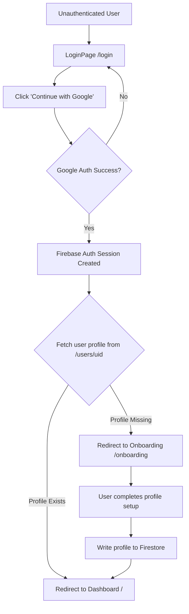

# Authentication & Onboarding Architecture (Google-First)

This document details the architecture for the Google-first authentication and onboarding flow. It eliminates standard email/password registration in favor of Google OAuth, followed by a mandatory onboarding step to collect Ahmedabad University profile details.

## Flow Diagram



## Routing States and Guards

The routes are protected by three custom guards:

1. **`PublicRoute`**: Accessible only when the user is logged out (e.g., `/login`). If logged in, redirects to `/`.
2. **`ProtectedRoute`**: Accessible when the user is logged in *and* has a complete profile in Firestore.
   * If logged out -> `/login`
   * If logged in but profile is null -> `/onboarding`
3. **`OnboardingRoute`**: Accessible only when the user is logged in *but has no profile* in Firestore yet.
   * If logged out -> `/login`
   * If logged in and has profile -> `/`

### Routes Map

| Path | Guard | Target Page |
| :--- | :--- | :--- |
| `/login` | `PublicRoute` | `LoginPage` (Only Google Auth button) |
| `/onboarding` | `OnboardingRoute` | `OnboardingPage` (Profile setup form) |
| `/` | `ProtectedRoute` | `DashboardPage` |
| `/*` (Admin, etc) | `ProtectedRoute` | Respective protected pages |

## Firestore Schema (`users` collection)

When onboarding is complete, a document is created in the `/users/{uid}` collection with the following fields:

```typescript
interface UserProfile {
  uid: string;           // Match Firebase Auth UID
  email: string;         // Pre-filled from Google Auth
  displayName: string;   // Pre-filled but editable
  contact: string;       // User's contact number
  userType: 'Student' | 'Professor or Faculty' | 'Venture Studio Startup' | 'External Visitor';
  isActive: boolean;     // Default: true
  createdAt: Timestamp;
  updatedAt: Timestamp;
  
  // Conditional fields based on userType
  universityId?: string; // Students
  department?: string;   // Students, Faculty
  courseName?: string;   // Students
  facultyAdvisor?: string; // Students
  teamName?: string;     // Students
  teamMembers?: string;  // Students
  
  researchArea?: string; // Faculty
  associatedCourse?: string; // Faculty
  studentsInvolved?: string; // Faculty
  
  startupName?: string;  // Venture Startup
  industryDomain?: string; // Venture Startup
  startupBrief?: string; // Venture Startup
  labTeamMembers?: string; // Venture Startup
  
  organization?: string; // External Visitor
  designation?: string;  // External Visitor
  purposeOfVisit?: string; // External Visitor
  referral?: string;     // External Visitor
  
  safetyAgreementAccepted: boolean; // Must be true
  termsAccepted: boolean;           // Must be true
}
```

## Component Breakdown

1. **`LoginPage.tsx`**:
   * Removed standard email/password login inputs.
   * Prominent "Continue with Google" button as the primary action.
2. **`OnboardingPage.tsx`** (formerly `RegisterPage.tsx`):
   * Serves as the profile setup screen.
   * Reads pre-filled user details (email and name) from `useAuth()`.
   * Displays step-by-step forms based on `userType` to collect profile information.
   * Writes data directly to Firestore on submit and completes authentication.
