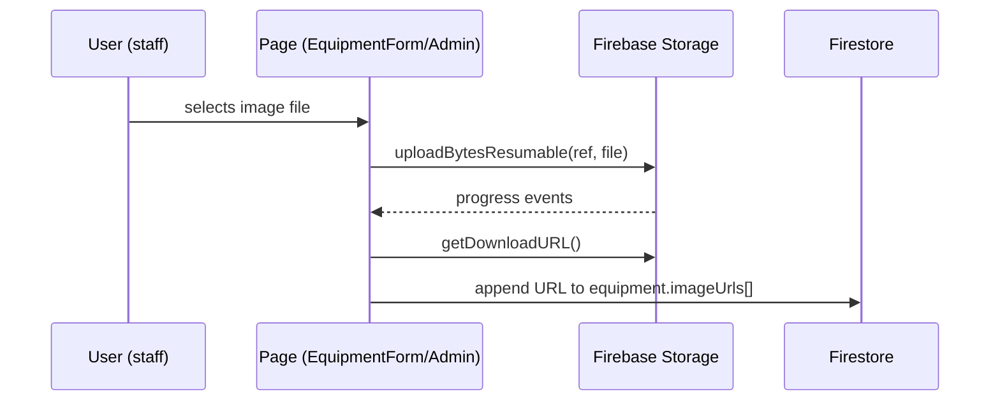

# 🗄 Firebase Storage — Tinkers' Lab Platform

> Storage layout, security rules, and the equipment-image upload pipeline.
>
> **Companion docs:** [`FIRESTORE.md`](FIRESTORE.md) (database) · [`DEPLOYMENT.md`](DEPLOYMENT.md) (rules deployment)

---

## 1. What Storage is used for

Only **equipment images** today. Project `imageUrls`/`documentUrls` and workshop `materialUrls` exist in the Firestore schema but have **no upload UI yet**.

## 2. Path layout

```
equipment/{equipmentId}/{timestamp}_{sanitizedFileName}
```

Example: `equipment/bambu-x1c/1723641234567_side_view.png`

- File names are sanitized (`[^a-zA-Z0-9._-]` → `_`) before upload (`src/services/firebase/equipmentImages.ts`).
- Upload uses `uploadBytesResumable` (progress events), then `getDownloadURL`; the URL is appended to the equipment doc's `imageUrls[]`.
- Limits: **max 5 images** per equipment (`MAX_IMAGES`), **max 5 MB** each.

## 3. Security rules (`storage.rules`)

| Path | read | write | delete |
|---|---|---|---|
| `equipment/{equipmentId}/{fileName}` | any authenticated user | staff only, `image/(jpeg\|png\|webp)`, ≤ 5 MB | staff only |
| `{allPaths=**}` (default) | **deny** | **deny** | **deny** |

- The `isStaff()` helper in `storage.rules` reads the caller's Firestore `users/{uid}` doc to check `role ∈ [super_admin, faculty, lab_assistant]`.
- Content-type and size checks run on every write (no other file types are permitted).

## 4. Client flow



Rules gate the upload (`isStaff` + type/size), then the URL write to Firestore is gated by the `equipment` rules (staff write).

## 5. Deploying storage rules

```bash
firebase deploy --only storage
```

> ⚠️ Like Firestore rules, Storage rules are **server-side enforcement** — the client UI only mirrors them for UX.
