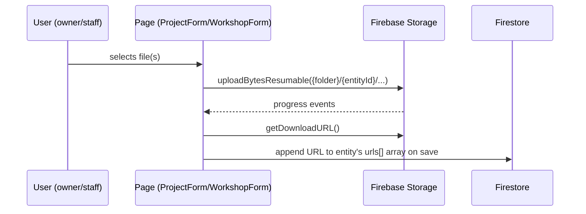

# 🗄 Firebase Storage — Tinkers' Lab Platform

> Storage layout, security rules, and the equipment-image upload pipeline.
>
> **Companion docs:** [`FIRESTORE.md`](FIRESTORE.md) (database) · [`DEPLOYMENT.md`](DEPLOYMENT.md) (rules deployment)

---

## 1. What Storage is used for

Three file groups, all under size/type-restricted rules:

| Path | Who writes | Types / size |
|---|---|---|
| `equipment/{equipmentId}/{fileName}` | Staff | jpeg/png/webp ≤ 5 MB |
| `projects/{projectId}/images/{fileName}` | Project owner or staff | jpeg/png/webp ≤ 5 MB |
| `projects/{projectId}/documents/{fileName}` | Project owner or staff | pdf/docx/txt/md/images ≤ 10 MB |
| `workshops/{workshopId}/{fileName}` | Staff | pdf/docx/txt/md/images ≤ 10 MB |

Project `imageUrls`/`documentUrls` and workshop `materialUrls` uploads are wired in `ProjectFormPage` / `WorkshopFormPage` via the shared [`FileUploader`](../../src/components/common/FileUploader.tsx) component.

## 2. Path layout

```
equipment/{equipmentId}/{timestamp}_{sanitizedFileName}
```

Example: `equipment/bambu-x1c/1723641234567_side_view.png`

- File names are sanitized (`[^a-zA-Z0-9._-]` → `_`) before upload (`src/services/firebase/equipmentImages.ts`).
- Upload uses `uploadBytesResumable` (progress events), then `getDownloadURL`; the URL is appended to the equipment doc's `imageUrls[]`.
- Limits: **max 5 images** per equipment (`MAX_IMAGES`), **max 5 MB** each.

## 3. Security rules (`storage.rules`)

| Path | read | write | delete |
|---|---|---|---|
| `equipment/{equipmentId}/{fileName}` | any authenticated user | staff only, `image/(jpeg\|png\|webp)`, ≤ 5 MB | staff only |
| `projects/{projectId}/images/{fileName}` | any authenticated user | **project owner or staff**, `image/(jpeg\|png\|webp)`, ≤ 5 MB | owner or staff |
| `projects/{projectId}/documents/{fileName}` | any authenticated user | **project owner or staff**, pdf/docx/txt/md/images, ≤ 10 MB | owner or staff |
| `workshops/{workshopId}/{fileName}` | any authenticated user | staff only, pdf/docx/txt/md/images, ≤ 10 MB | staff only |
| `{allPaths=**}` (default) | **deny** | **deny** | **deny** |

- The `isStaff()` and `isProjectOwner(projectId)` helpers in `storage.rules` read the caller's Firestore `users/{uid}` / `projects/{projectId}` docs to authorize.
- Content-type and size checks run on every write (no other file types are permitted).

## 4. Client flow

The generic [`uploads.ts`](../../src/services/firebase/uploads.ts) service + [`FileUploader`](../../src/components/common/FileUploader.tsx) component drive all uploads:



## 5. Deploying storage rules

```bash
firebase deploy --only storage
```

> ⚠️ Like Firestore rules, Storage rules are **server-side enforcement** — the client UI only mirrors them for UX.
