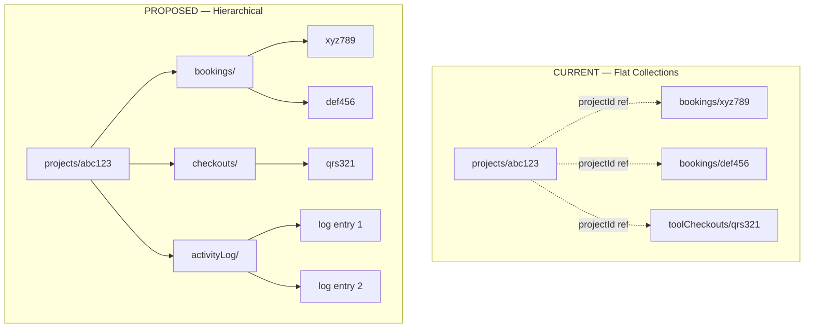

# Firestore Data Architecture Optimization — Project-Centric Restructure

## Problem Statement

The current architecture stores 16 **flat, top-level collections** with no structural relationship between them. When you want to answer "*what happened on project TL-007?*" — every booking, every tool checkout, every consumable log — you must query `bookings` by `projectId`, then `toolCheckouts` by `projectId`, then mentally stitch them together. There is no single place that owns all data for a project.

Additionally, there are several concrete bugs and inefficiencies:

1. **`TL-XXX` business ID silently overwritten** — `getUserProjects()` maps `{ id: d.id, ...d.data() }`, which replaces the `TL-XXX` `id` field with the Firestore doc ID. The project dropdown stores Firestore doc IDs into `projectId` on bookings/checkouts, but displays `p.id` (now the Firestore ID) as if it were `TL-XXX`.
2. **`TL-XXX` generation is not atomic** — `getCountFromServer()` is racy under concurrent registrations.
3. **No project activity log** — there's no way to see a timeline of "items taken for project X" without joining across collections.
4. **Denormalized data is never updated** — if a project title changes, old bookings keep the stale `projectTitle`.

## Proposed Architecture

### Core Idea: Project becomes the anchor document, with subcollections underneath

```
projects/{projectDocId}                     ← the project document (same fields as today)
  ├── bookings/{bookingId}                  ← subcollection: machine bookings for this project
  ├── checkouts/{checkoutId}                ← subcollection: tool checkouts for this project
  └── activityLog/{logId}                   ← subcollection: unified timeline entries
```

**Everything stays under `projects/{projectDocId}/...`**, so a single `collectionGroup` query can still retrieve all bookings across projects (for the admin view), while a scoped `collection` query retrieves just one project's bookings.

> [!IMPORTANT]
> **This is a significant structural change.** Subcollections change how queries, security rules, and indexes work. This plan is designed to be done incrementally — we can migrate one collection at a time and support both old and new data during transition.

---

## User Review Required

> [!WARNING]
> **Breaking change for existing data.** Documents already in the top-level `bookings` and `toolCheckouts` collections will need to be migrated. A migration script is included in the plan. If you have production data, we'll run the migration before switching the code.

> [!IMPORTANT]
> **Subcollection queries require collection group indexes.** Firestore requires explicit collection group indexes for querying across all `bookings` subcollections (e.g., admin "all bookings" view). These are included in the plan.

---

## Open Questions

> [!IMPORTANT]
> 1. **Do you want to migrate existing data?** If you have real data in production `bookings` / `toolCheckouts`, I'll write a migration script. If this is still dev-only, we can start fresh.
> 2. **Counter document for `TL-XXX`** — should I implement an atomic counter doc (`counters/projects` → `{nextId: 42}`) wrapped in a transaction, or would you prefer a Cloud Function for this?
> 3. **Activity log granularity** — should the `activityLog` subcollection also capture project status changes (approved/rejected), or only resource usage (bookings/checkouts)?

---

## Proposed Changes

### 1. Fix the `id` / `projectCode` confusion

#### [MODIFY] [firestore.ts](file:///c:/Users/Naman%20Sinha/Desktop/tinkers-lab-platform/src/services/firebase/firestore.ts)
- Add a `COUNTERS` collection name for the atomic counter document.

#### [MODIFY] [index.ts](file:///c:/Users/Naman%20Sinha/Desktop/tinkers-lab-platform/src/types/index.ts)
- Rename the `Project.id` field to `Project.projectCode` (the `TL-XXX` business ID).
- The Firestore doc ID continues to be `id` (mapped by `d.id`), consistent with every other collection.
- This eliminates the silent overwrite bug.

#### [MODIFY] [projects.ts](file:///c:/Users/Naman%20Sinha/Desktop/tinkers-lab-platform/src/services/firebase/projects.ts)
- **Atomic counter**: Replace `getCountFromServer()` with a `runTransaction` on `counters/projects` → `{ nextId: N }`. The transaction reads the counter, increments it, and writes the new project with `projectCode: TL-{N}` in one atomic operation. No more race conditions.
- `getUserProjects()` and `getProjectsByStatus()` — no more `id` collision; `projectCode` is a separate field.

---

### 2. Restructure bookings and checkouts as project subcollections

#### [MODIFY] [bookings.ts](file:///c:/Users/Naman%20Sinha/Desktop/tinkers-lab-platform/src/services/firebase/bookings.ts)
- `createBooking()` → writes to `projects/{projectId}/bookings/{autoId}` instead of top-level `bookings`.
- `createBooking` → server callable uses a **collection group query** on `bookings` (all projects) scoped by `equipmentId + date + status` inside a transaction.
- User booking history uses the current collection-group reads in the dashboard and calendar.
- `getBookingsForSlot()` → collection group query (unchanged shape).

#### [MODIFY] [toolCheckouts.ts](file:///c:/Users/Naman%20Sinha/Desktop/tinkers-lab-platform/src/services/firebase/toolCheckouts.ts)
- `createToolCheckout()` → server callable writes to `projects/{projectId}/checkouts/{autoId}` and appends the checkout timeline entry atomically.
- `getActiveUserCheckouts()` → collection group query on `checkouts` where `userId == uid && action == 'checking_out'`.
- `getAllCheckouts()` / `getAllActiveCheckouts()` → collection group queries; overdue state is marked by the scheduled function.
- `returnTool()` → needs the full path `projects/{projectId}/checkouts/{checkoutId}`. We'll store `projectId` on the checkout doc (already there) and use it to construct the path.

#### [NEW] [activityLog.ts](file:///c:/Users/Naman%20Sinha/Desktop/tinkers-lab-platform/src/services/firebase/activityLog.ts)
- When a booking or checkout is created, also write a summary entry to `projects/{projectId}/activityLog/{autoId}`:
  ```ts
  {
    type: 'booking' | 'checkout' | 'return' | 'status_change',
    summary: "Booked Bambu X1C for 2h" | "Checked out Multimeter (qty: 2)",
    resourceId: bookingId | checkoutId,
    userId, userName, userEmail,
    createdAt: serverTimestamp(),
  }
  ```
- This gives you a **unified, chronological project timeline** with zero cross-collection joins.

---

### 3. Update security rules

#### [MODIFY] [firestore.rules](file:///c:/Users/Naman%20Sinha/Desktop/tinkers-lab-platform/firestore.rules)

Replace top-level `bookings` and `toolCheckouts` rules with nested subcollection rules:

```
match /projects/{projectId}/bookings/{bookingId} {
  // Same rules as today, but scoped under the project
  allow read: ...
  allow create: ...
  allow update: ...
}

match /projects/{projectId}/checkouts/{checkoutId} {
  // Same rules as today
}

match /projects/{projectId}/activityLog/{logId} {
  allow read: if isAuth() && (
    get(/databases/$(database)/documents/projects/$(projectId)).data.userId == request.auth.uid
    || isStaff()
  );
  allow create: if isActiveUser();
  allow update, delete: if false; // Immutable log
}
```

Also add a `counters` collection rule:
```
match /counters/{counterId} {
  allow read: if isActiveUser();
  // Write happens inside runTransaction in createProject — rules allow if active
  allow write: if isActiveUser();
}
```

---

### 4. Update indexes

#### [MODIFY] [firestore.indexes.json](file:///c:/Users/Naman%20Sinha/Desktop/tinkers-lab-platform/firestore.indexes.json)

- Change all `bookings` and `toolCheckouts` indexes from `"queryScope": "COLLECTION"` to `"queryScope": "COLLECTION_GROUP"`.
- Add new indexes for `activityLog` collection group queries.
- Add new index for `checkouts` collection group queries.

---

### 5. Update all UI components

#### [MODIFY] [BookingFormPage.tsx](file:///c:/Users/Naman%20Sinha/Desktop/tinkers-lab-platform/src/features/bookings/BookingFormPage.tsx)
- Project dropdown: use `p.projectCode` for display, `p.id` (Firestore doc ID) for value.
- Submit: pass `projectId` (Firestore doc ID) to `createBooking()` — it now writes to the subcollection.

#### [MODIFY] [ToolCheckoutPage.tsx](file:///c:/Users/Naman%20Sinha/Desktop/tinkers-lab-platform/src/features/checkout/ToolCheckoutPage.tsx)
- Same dropdown fix: `p.projectCode` for display, `p.id` for value.

#### [MODIFY] [ProjectDetailPage.tsx](file:///c:/Users/Naman%20Sinha/Desktop/tinkers-lab-platform/src/features/projects/ProjectDetailPage.tsx)
- Add a new **"Activity Log"** section at the bottom — queries `projects/{id}/activityLog` and renders a chronological timeline.
- This is the "everything about this project in one place" view you described.

#### [MODIFY] [AdminProjectsPage.tsx](file:///c:/Users/Naman%20Sinha/Desktop/tinkers-lab-platform/src/features/admin/AdminProjectsPage.tsx)
- Display `projectCode` column instead of `p.id`.

#### [MODIFY] [AdminBookingsPage.tsx](file:///c:/Users/Naman%20Sinha/Desktop/tinkers-lab-platform/src/features/admin/AdminBookingsPage.tsx)
- Queries change to collection group queries.

#### [MODIFY] [AdminDashboard.tsx](file:///c:/Users/Naman%20Sinha/Desktop/tinkers-lab-platform/src/features/admin/AdminDashboard.tsx)
- Count queries change to collection group for bookings/checkouts.

#### [MODIFY] [DashboardPage.tsx](file:///c:/Users/Naman%20Sinha/Desktop/tinkers-lab-platform/src/features/dashboard/DashboardPage.tsx)
- User's bookings/checkouts queries change to collection group.

#### [MODIFY] [BookingCalendarPage.tsx](file:///c:/Users/Naman%20Sinha/Desktop/tinkers-lab-platform/src/features/bookings/BookingCalendarPage.tsx)
- Booking queries change to collection group.

#### [MODIFY] [BookingDetailPage.tsx](file:///c:/Users/Naman%20Sinha/Desktop/tinkers-lab-platform/src/features/bookings/BookingDetailPage.tsx)
- Needs full path (`projects/{projectId}/bookings/{bookingId}`) — uses `projectId` stored on the booking doc.

#### [MODIFY] [ToolCheckoutListPage.tsx](file:///c:/Users/Naman%20Sinha/Desktop/tinkers-lab-platform/src/features/checkout/ToolCheckoutListPage.tsx)
- Queries change to collection group.

#### [MODIFY] [ReportsPage.tsx](file:///c:/Users/Naman%20Sinha/Desktop/tinkers-lab-platform/src/features/reports/ReportsPage.tsx)
- All booking/checkout data queries change to collection group queries.

---

### 6. Migration script (if needed)

#### [NEW] [scripts/migrateToSubcollections.ts](file:///c:/Users/Naman%20Sinha/Desktop/tinkers-lab-platform/scripts/migrateToSubcollections.ts)
- Reads all top-level `bookings` documents → writes each to `projects/{projectId}/bookings/{docId}`.
- Reads all top-level `toolCheckouts` documents → writes each to `projects/{projectId}/checkouts/{docId}`.
- Generates initial `activityLog` entries for existing data.
- Initializes the `counters/projects` document with `nextId` = current project count + 1.
- Idempotent: re-running it won't duplicate data (uses the same document IDs).

---

## Architecture Comparison

| Aspect | Current | Proposed |
|---|---|---|
| **"All activity for project X"** | 3 separate queries across collections | Single subcollection read |
| **Project ID (`TL-XXX`)** | Silently overwritten by Firestore doc ID | Separate `projectCode` field, never lost |
| **ID generation** | Racy `getCountFromServer()` | Atomic `runTransaction` on counter doc |
| **Admin "all bookings" view** | Direct collection query | Collection group query (same perf) |
| **Firestore reads** | Same — denormalization still avoids joins | Slightly fewer — project context is implicit |
| **Security rules** | Flat per-collection | Hierarchical, project-scoped |
| **Activity timeline** | Doesn't exist | `activityLog` subcollection per project |
| **Data locality** | Scattered across 16 collections | Related data co-located under project |



---

## Verification Plan

### Automated Tests
```bash
# Deploy rules to emulator and test
firebase emulators:start --only firestore
# Run the app against emulators
VITE_USE_EMULATORS=true npm run dev
```

### Manual Verification
1. **Create a project** → verify `projectCode` is `TL-001` and `id` (Firestore doc ID) is separate.
2. **Create a booking** → verify it lands in `projects/{projectDocId}/bookings/{bookingId}`.
3. **Create a tool checkout** → verify it lands in `projects/{projectDocId}/checkouts/{checkoutId}`.
4. **View project detail page** → verify the activity log shows all bookings and checkouts.
5. **Admin bookings page** → verify all bookings across all projects still appear (collection group query).
6. **Admin dashboard counts** → verify KPI tiles still show correct counts.
7. **Conflict detection** → verify booking time slot conflicts still work across all projects.
8. **Return a tool** → verify the return updates the correct subcollection document.
